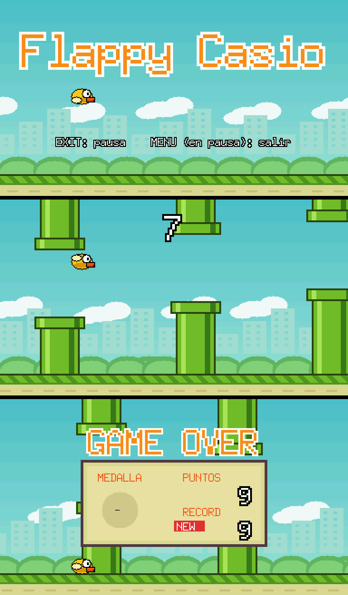

# Flappy Casio — Flappy Bird para Casio fx-CG10 / fx-CG20 / fx-CG50



## Instalar

Copia **`FlappyCasio.g3a`** a la raíz de la calculadora (USB → Memoria USB).
Aparecerá **Flappy** en el menú principal.

## Controles

| Tecla | Acción |
|---|---|
| **SHIFT**, **EXE**, **▲**, F1 o ALPHA | Aletear |
| **EXIT** | Pausa |
| MENU (desde la pausa) | Salir al menú |

Pasa entre las tuberías. Los huecos se estrechan poco a poco y a partir de
15 puntos todo va más rápido. Medallas: bronce (10), plata (20), oro (30) y
platino (40). El récord se guarda mientras no salgas del juego.

## Compilar

Usa las mismas dependencias que CasioIA:

```sh
../casio-ia/build.sh   # prepara libfxcg y mkg3a (solo la primera vez)
make
```
