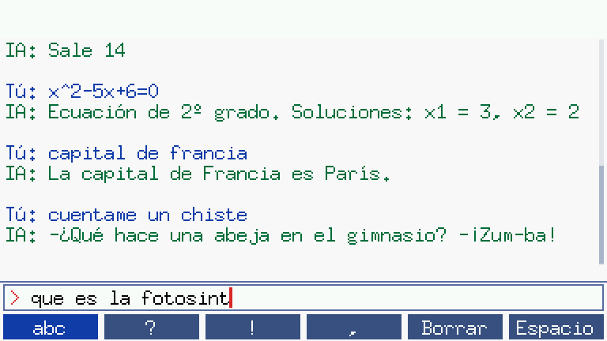

# CasioIA — chat "IA" para Casio fx-CG10 / fx-CG20 / fx-CG50

Add-in (`.g3a`) que convierte la calculadora en un asistente con el que puedes
**escribir y charlar**. Funciona 100 % offline (la calculadora no tiene internet):
combina una calculadora en lenguaje natural, un resolvedor de ecuaciones, una
base de conocimiento, memoria de la conversación y minijuegos.



## Instalar

1. Conecta la calculadora al PC con el cable USB y elige **Memoria USB** (F1).
2. Copia **`CasioIA.g3a`** a la raíz de la calculadora.
3. Desconecta. Aparecerá **CasioIA** en el menú principal.

## Teclas

| Tecla | Acción |
|---|---|
| Letras | Escribe (el programa activa ALPHA-lock automáticamente) |
| **F1** | Cambia modo: `abc` (minúsculas) → `ABC` → `123` (números y operadores) |
| F2 / F3 / F4 | Insertan `?` `!` `,` |
| **F5** | Borra el chat |
| **F6** | Espacio |
| **EXE** | Enviar |
| DEL / AC | Borrar letra / borrar línea |
| ◀ ▶ | Mover el cursor |
| ▲ ▼ | Desplazar el historial |
| MENU | Salir |

Las teclas de la calculadora (`+ − × ÷ ^ x² √ sin cos tan log ln π`) también
funcionan en modo `123`.

## Qué sabe hacer

- **Cálculos**: `cuanto es 3 por 4 mas 2`, `raiz de 81`, `20% de 150`,
  `sin(30)` (en grados), `2^10`, `5!`, `log(1000)`, `dos por tres`…
- **Ecuaciones en x**: `2x+3=11`, `x^2-5x+6=0`, `x^3=27`
- **Preguntas**: fórmulas (Pitágoras, áreas, volúmenes, derivadas…), física,
  química, biología, espacio, capitales, historia…
- **Memoria**: `me llamo Ana` → luego `como me llamo`; `tengo 15 años`;
  `me gusta la pizza`
- **Diversión**: `chiste`, `dato curioso`, `frase`, `consejo`, `trabalenguas`
- **Juegos**: `adivina` (número del 1 al 100), `piedra`/`papel`/`tijera`,
  `adivinanza`, `moneda`, `dado`, `numero aleatorio entre 1 y 6`
- `que hora es`, `ayuda`… y si no entiende algo, responde como un
  psicólogo (estilo ELIZA): `estoy cansado`, `quiero un perro`…

Para ampliar su conocimiento, añade reglas a la tabla `reglas[]` de
[`src/ia.c`](src/ia.c): `{ "palabras|otra frase|capital&pais", "respuesta 1|respuesta 2" }`.

## Compilar

En Linux (Ubuntu/Debian):

```sh
sudo apt install gcc-sh-elf binutils-sh-elf cmake libpng-dev
./build.sh        # descarga libfxcg y mkg3a, y genera CasioIA.g3a
make test         # prueba el motor de conversación en el PC
```

Estructura:

- `src/main.c` — interfaz: pantalla, teclado, historial con scroll
- `src/ia.c` — el "cerebro": reglas, mates, ecuaciones, memoria, juegos
- `src/font.h` — fuente 7×13 con tildes, ñ, ¿ y ¡ (generada con `tools/genfont.py`)
- `tools/` — generadores de fuente/iconos y prueba en PC
